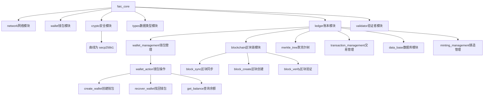

# MVP001版本要求：

核心目标：
1、实现FAIC钱包的创建、助记词找回、查询余额这三个功能。
2、管理员或开发者可以向指定钱包地址发放FAIC代币。

开发要求：
1、节点程序使用rust开发，network网络模块使用libp2p框架。
2、先开发节点程序，通过curl命令行工具对各个功能测试验证，再开发客户端。
3、逐个实现各个函数或功能，不要一次性实现所有功能。对每个函数或功能都要有详细的注释。
4、将各个模块的数据类型要求统一在/src/types/模块中。
5、要在代码中加入恰当的打印，错误追踪，日志，方便调试。
6、客户端使用flutter开发，只开发ios与android。

# MVP001 开发计划

## 项目框架

## 核心逻辑
1、钱包客户端(ios/android)处理签名，节点验证签名。验证通过后，将交易记录广播到其他节点。
2、使用minting铸造模块，铸造出代币，然后发放给早期捐赠者。
3、铸造属于交易记录的一种类型，铸造记录应该记录在区块链中，并记录在merkletree中，同时也存储在节点的数据库中。
4、merkletree负责实现数据完整性、轻量级验证、存储优化、区块验证加速。
5、blockchain负责实现：
    - 通过工作量证明(PoW)创建新区块
    - 验证区块哈希难度和交易有效性
    - 管理主链/侧链数据结构
    - 与网络模块协作完成区块链同步 
6、DB数据库使用 SQLite 通过 sqlx 实现结构化存储，包含以下核心表：
    - 区块表(blocks): 存储区块头元数据（父哈希/高度/时间戳/Merkle根）
    - 交易表(transactions): 关联区块哈希存储已确认交易详情
    - 钱包表(wallets): 记录账户可用余额、锁定余额和交易序号 
    - 交易池表(transaction_pool): 实现交易池的持久化存储
    - 区块与交易关系: 通过 block_hash 外键关联（非简单高度映射）
