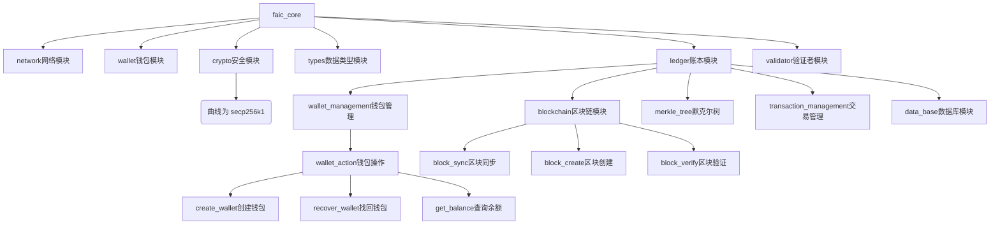

# MVP001版本要求：

核心目标：
1、实现FAIC钱包的创建、助记词找回、查询余额这三个功能。
2、管理员或开发者可以向指定钱包地址发放FAIC代币。

开发要求：
1、节点程序使用rust开发，network网络模块使用libp2p框架。
2、先开发节点程序，通过curl命令行工具对各个功能测试验证，再开发客户端。
3、逐个实现各个函数或功能，不要一次性实现所有功能。对每个函数或功能都要有详细的注释。
4、将各个模块的数据类型要求统一在/src/types/模块中。
5、要在代码中加入恰当的打印，错误追踪，日志，方便调试。
6、客户端使用flutter开发。

# MVP001 开发计划

## 项目框架

    

